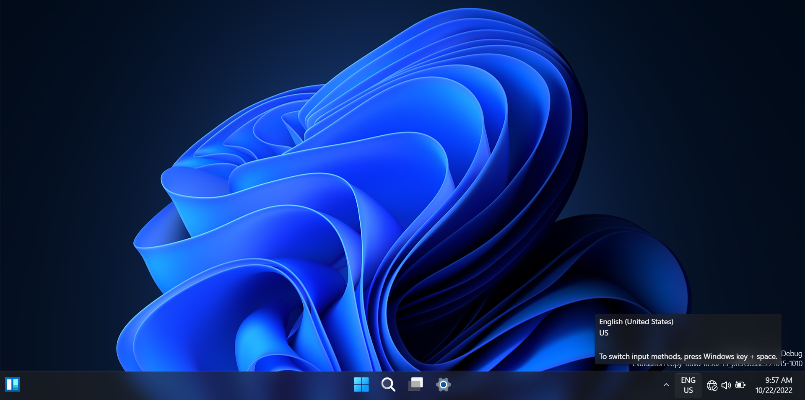
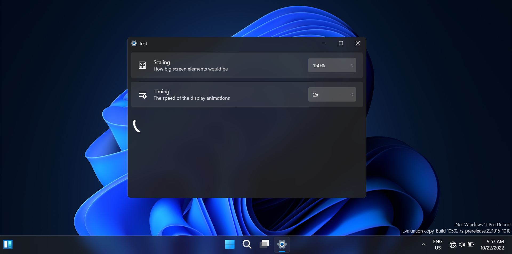
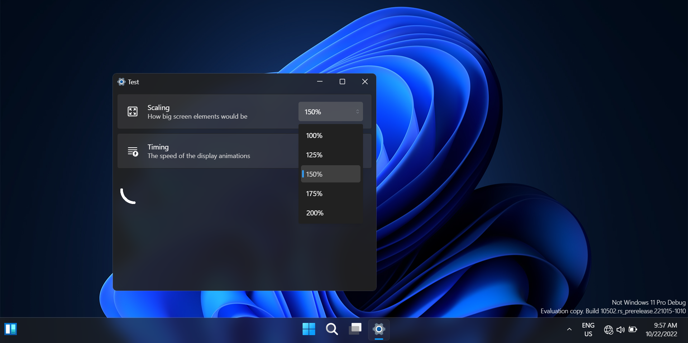
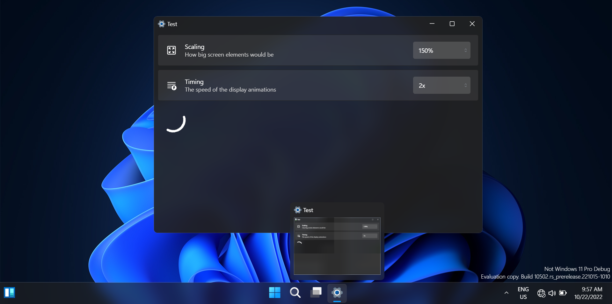

# w11-react

A _(probably)_ bad clone of Windows 11 for the web, created using the ReactJS Framework

## _This project is far from finished_

## Notice

> This project is not in anyway affiliated with Microsoft and should not be confused with Microsoft’s Operating System or Products. This is not a Windows 365 cloud PC.

## Inspirations

1. [Microsoft Windows 11 Operating System](https://windows.com)
1. Blue edges' [win11React](https://github.com/blueedgetechno/win11React)

## Features

- [x] Desktop
- [x] Window open, resize, maximize, close, etc...
- [x] Window previews
- [ ] Pinning Apps
- [ ] Start Menu & Search
- [ ] Context Menus
- [ ] Notifiction Panel
- [ ] Action Panel

## Framework and Libraries

- [ReactJS](https://reactjs.org)
- [Mantine](https://mantine.dev)
- [Iconify](https://iconify.design)
- [Sass CSS](https://sass-lang.com)

## Screenshots

## Tested

Working only on chromium based browsers

## Resources

- Icon assets are remade and are available on [Figma](https://www.figma.com/file/pguF5NU55245T6ExgdlKmn/W11-custom?node-id=0%3A1)
- Windows 11 Dark - © Microsoft Windows
- Segoe UI Variable - © Microsoft Corporation

## Contributing

- All contributions are welcome as long as
  - it doesn't contains breaking changes
  - improves code quality
  - does not replace ternary operators into "something better"

## Preview

- You can view the live version here
